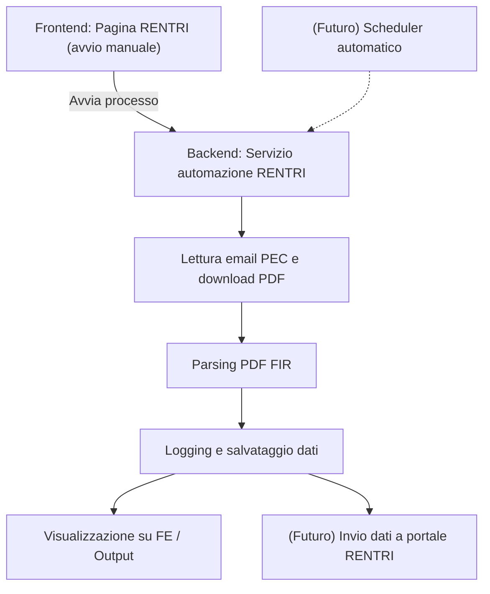

# Roadmap Automazione RENTRI

## Flusso generale

1. **Avvio manuale da Frontend** (pagina RENTRI)
2. **Backend**:
   - Lettura email PEC e download PDF FIR
   - Parsing PDF FIR e salvataggio dati estratti
   - Logging delle operazioni
   - (Futuro) Invio dati al portale RENTRI
3. **Frontend**:
   - Visualizzazione stato, log, ultimi FIR processati, errori
   - Avvio manuale del processo
4. **Scheduler** (futuro):
   - Automatizzazione periodica del processo (come per SMS)

---

## Mappa del flusso (Mermaid)

---

## Roadmap step-by-step

- [ ] **1. Adattare pec_reader.py e parser.py come servizi riutilizzabili**
    - [ ] Refactoring funzioni in moduli importabili
    - [ ] Gestione configurazione tramite settings del progetto
- [ ] **2. Creare endpoint REST nel backend**
    - [ ] POST /api/rentri/start → Avvia processo (lettura PEC + parsing)
    - [ ] GET /api/rentri/status → Stato ultimo processo/log
    - [ ] GET /api/rentri/fir → Ultimi FIR estratti
- [ ] **3. Collegare la pagina FE agli endpoint**
    - [ ] Bottone "Avvia automazione"
    - [ ] Tabella/Lista ultimi FIR processati
    - [ ] Visualizzazione log/stato
- [ ] **4. Centralizzare logging**
    - [ ] Logging su file/DB/array in memoria
    - [ ] Visualizzazione log da FE
- [ ] **5. Preparare struttura per schedulazione futura**
    - [ ] Task scheduler backend (es. come SMS)
    - [ ] Configurazione da FE (futuro)
- [ ] **6. (Futuro) Invio dati a portale RENTRI**
    - [ ] Analisi API/automazione browser
    - [ ] Implementazione invio automatico

---

## Note
- Tutti gli step possono essere flaggati man mano che vengono completati.
- Aggiornare la roadmap aggiungendo dettagli o sotto-task se necessario. 